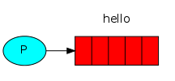
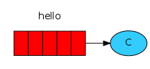
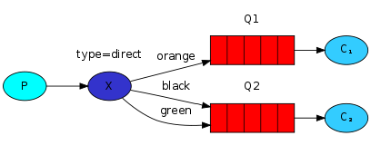
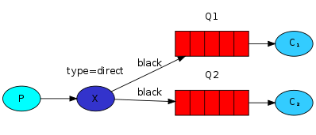

RabbitMQ是消息代理：它接受并转发消息

消息发布者（发送者）Send、消息消费者（接收者） Recv

**发送**



**接收**




一、Work Queues

```
1、一个生产者、2个消费者。
2、一个消息只能被一个消费者获取。
```

主要思想是避免立即执行资源密集型任务，而不得不等待它完成。

使用任务队列的优点之一是能够轻松并行化工作。

1、消息确认

​		RabbitMQ支持 [消息*确认*](https://www.rabbitmq.com/confirms.html)。消费者发送回一个确认（acknowledgement），以告知RabbitMQ已经接收，处理了特定的消息，并且RabbitMQ可以自由删除它。默认情况下，[手动消息确认](https://www.rabbitmq.com/confirms.html)处于打开状态。通过autoAck = true 标志显式关闭了它们。

模式1：自动确认
		只要消息从队列中获取，无论消费者获取到消息后是否成功消息，都认为是消息已经成功消费。
模式2：手动确认
		消费者从队列中获取消息后，服务器会将该消息标记为不可用状态，等待消费者的反馈，如果消费者一直没有反馈，那么该消息将一直处于不可用状态。

```java
channel.basicQos(1); // accept only one unack-ed message at a time (see below)
DeliverCallback deliverCallback = (consumerTag, delivery) -> {
  String message = new String(delivery.getBody(), "UTF-8");
  System.out.println(" [x] Received '" + message + "'");
  try {
    doWork(message);
  } finally {
    System.out.println(" [x] Done");
    channel.basicAck(delivery.getEnvelope().getDeliveryTag(), false);
  }
};
boolean autoAck = false;
channel.basicConsume(TASK_QUEUE_NAME, autoAck, deliverCallback, consumerTag -> { });
```

2、手动确认缺少basicAck。

​		是一个常见的错误，但是后果很严重。当客户端退出时，消息将被重新发送（看起来像是随机重新发送），但是RabbitMQ将消耗越来越多的内存，因为它将无法释放任何未确认的消息。

3、持久性

​		RabbitMQ退出或崩溃时，它将忘记队列和消息，除非您告知不要这样做。要确保消息不会丢失，需要做两件事：我们需要将队列和消息都标记为持久性。

```java
boolean durable = true;
channel.queueDeclare("hello", durable, false, false, null);
```

​		将消息标记为持久性并不能完全保证不会丢失消息。尽管它告诉RabbitMQ将消息保存到磁盘，但是RabbitMQ接受消息但尚未将其保存仍然有很短的时间。另外，RabbitMQ不会对每条消息都执行fsync（2）－它可能只是保存到缓存中，而没有真正写入磁盘。

4、公平派遣，能者多劳


​		将basicQos方法与 prefetchCount = 1设置一起使用。这告诉RabbitMQ一次不要给工人一个以上的消息。换句话说，在处理并确认上一条消息之前，不要将新消息发送给工作人员。而是将其分派给尚不繁忙的下一个工作人员。

```java
int prefetchCount = 1 ; 
channel.basicQos（prefetchCount）;
```


二、发布/订阅

```
1、1个生产者，多个消费者
2、每一个消费者都有自己的一个队列
3、生产者没有将消息直接发送到队列，而是发送到了交换机
4、每个队列都要绑定到交换机
5、生产者发送的消息，经过交换机，到达队列，实现，一个消息被多个消费者获取的目的
```

将消息传达给多个消费者。这种模式称为“发布/订阅”。

RabbitMQ消息传递模型中的核心思想是生产者从不将任何消息直接发送到队列。实际上，生产者经常甚至根本不知道是否将消息传递到任何队列。

**Exchanges**

生产者只能将消息发送到*交换机*。

交换机一方面，它接收来自生产者的消息，另一方面，将它们推入队列。交易所必须确切知道如何处理收到的消息。是否应将其附加到特定队列？是否应该将其附加到许多队列中？还是应该丢弃它。规则由*交换类型*定义 。


有几种交换类型可用：direct，topic，headers 和fanout。

默认交换，我们通过空字符串（“”）进行标识。空字符串表示默认或*无名称*交换：消息将以routingKey指定的名称路由到队列（如果存在）

```java
// 创建fanout交换，并将其称为log：
channel.exchangeDeclare("logs", "fanout");
// 第一个参数是交换的名称。
channel.basicPublish("", "hello", null, message.getBytes());
```

**临时队列**

```java
// 当我们不向queueDeclare（）提供任何参数时，我们将 使用生成的名称创建一个非持久的，排他的，自动删除的队列：
String queueName = channel.queueDeclare().getQueue();
```


三、Routing路由模式

**绑定**

是交换和队列之间的关系。可以简单地理解为：队列对来自此交换的消息感兴趣。

```java
// 交换和队列之间的关系称为*绑定*。告诉交换机将消息发送到我们的队列。
// 绑定可以使用额外的routingKey参数。为了避免与basic_publish参数混淆，我们将其称为 binding key。
channel.queueBind（queueName，"logs"，""）;
channel.queueBind（queueName，EXCHANGE_NAME，""）;
```


**直接交换**Direct exchange

直接交换背后的路由算法很简单-一条消息进入其绑定密钥与该消息的路由密钥完全匹配的队列 。



绑定了两个队列的直接交换X。第一个队列由绑定键orange绑定，第二个队列有两个绑定，一个绑定键为black，另一个绑定为green。


**多重绑定**



用相同的绑定密钥绑定多个队列是完全合法的。


**Emitting logs**


四、Topics

Topic exchange

主题交换的消息不能具有任意的 routing_key-它必须是单词列表，以点分隔。

示例：“ stock.usd.nyse ”，“ nyse.vmw ”，“ quick.orange.rabbit ”。

路由密钥中可以包含任意多个单词，最多255个字节。

绑定密钥还必须采用相同的形式。主题交换背后的逻辑类似于直接交换的逻辑 -使用特定路由密钥发送的消息将传递到所有使用匹配绑定密钥绑定的队列。但是，绑定键有两个重要的特殊情况：

- *（星号）可以代替一个单词。
- ＃（哈希）可以替代零个或多个单词。


当一个队列用“ ＃ ”（哈希）绑定键绑定时，它将接收所有消息，而与路由键无关，就像在fanout 交换中一样。

当在绑定中不使用特殊字符“ * ”（星号）和“ ＃ ”（哈希）时，主题交换的行为就像直接的一样。