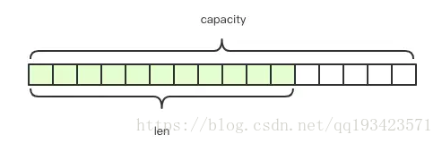
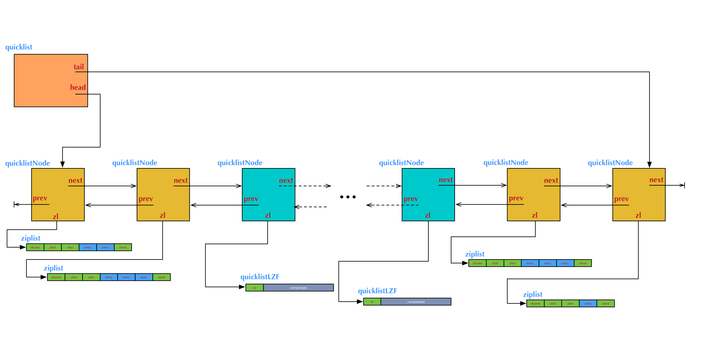
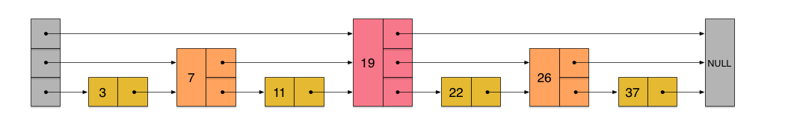

**五种数据结构**

```java
// 源码server.h定义
/* The actual Redis Object */
#define OBJ_STRING 0
#define OBJ_LIST 1 
#define OBJ_SET 2
#define OBJ_ZSET 3
#define OBJ_HASH 4
```


##### 一、String

底层实现是简单动态字符串**sds**(simple dynamic string)，是可以修改的字符串。

采用预分配冗余空间的方式来减少内存的频繁分配，类似于Java中的ArrayList



```shell
## 容量
capacity是最大容量，len是实际长度，一般要高于实际字符串长度 len。
## 扩容
当字符串长度小于 1M时，扩容都是加倍现有的空间，超过1M，扩容时一次只会多扩 1M 的空间。(字符串最大长度为512M)
```

**SDS结构体**

```shell
SDS本质上就是char *，能够兼容C字符串。是二进制安全的，它可以存储任意二进制数据

## 结构
1、len：已使用的长度，即字符串的真实长度
2、alloc：除去标头和终止符('\0')后的长度
3、flags：低3位表示字符串类型，其余5位未使用
4、buf[]：存储字符数据

## 对比c语言
	​ C语言字符串以‘\0’来标识字符串结束，符合ASCII编码，这种编码的操作的特点就是：遇零则止 。即，一个字符串，只要遇到’\0’结尾，就认为到达末尾，就忽略’\0’结尾以后的所有字符。如果传统字符串保存图片，视频等二进制文件，操作文件时就被截断了。
	​ SDS表头的buf被定义为字节数组，判断是否到达字符串结尾的依据则是表头的len成员，它可以存放任何二进制的数据和文本数据，包括’\0’

## 获得字符串长度
SDS表头的len成员保存着字符串长度，获得字符串长度的操作复杂度为O(1)，C 字符串复杂度为O(n)。

## 特点
sds的特点是：可动态扩展内存、二进制安全、快速遍历字符串 和与传统的C语言字符串类型兼容。

## 优点
1、降低获取字符串长度的时间复杂度到O(1)
2、减少了修改字符串时的内存重分配次数
3、兼容c字符串的同时，提高了一些字符串工具方法的效率
4、二进制安全（数据写入的格式和读取的格式一致）
```

**字符串的两种存储方式**

```mysql
存储形式
## embstr 
将 RedisObject 对象头和 SDS 对象连续存在一起，使用 malloc 方法一次分配。
## raw 
需要两次 malloc，两个对象头在内存地址上一般是不连续的。

①在长度特别短时，使用 emb 形式存储 (embedded)
②当长度超过 44 时，使用 raw 形式存储。

## 空间占用
	字符串比较小时，SDS 对象头的大小是 capacity+3 ——SDS结构体的内存大小至少是 3。意味着分配一个字符串的最小空间占用为 19 字节 (16+3)。
	总体超出了 64 字节，Redis 认为它是一个大字符串，不再使用 emdstr 形式存储，而该用 raw 形式。而64-19-结尾的\0，所以empstr只能容纳44字节。
## 扩容
为了避免加倍后的冗余空间过大而导致浪费，每次扩容只会多分配 SDS_MAX_PREALLOC大小的冗余空间。SDS_MAX_PREALLOC的容量大小定义在sds.h文件中，默认是 1024 * 1024，也就是1MB。
```


##### 二、list

有序字符串列表，用双向链表（double linked list）实现的，列表两端添加或删除元素的速度非常快，通过索引访问元素的速度比较慢。

```shell
## ziplist，压缩列表（3.2之前）
特殊编码的双向链表
可以用于存储字符串或整数
ziplist类似一个封装的数组，通过zltail可以方便地进行追加和删除尾部数据、使用entries可以方便地计算长度，
有数组的缺点，就是当插入和删除数据时会频繁地引起数据移动

双向链表对比ziplist
①双向链表便于在表的两端进行push和pop操作，但是内存开销比较大。每个节点上除了要保存数据，还要保存两个指针；各个节点是单独的内存块，地址不连续，容易产生内存碎片。
②ziplist由于是一整块连续内存，所以存储效率很高。但不利于修改操作，每次变动都会引发一次内存的realloc。当ziplist长度很长时，realloc可能会导致大批量的数据拷贝，降低性能。

## quicklist，快速列表
是一个双向链表，在微观上，每一个quicklist的节点都是一个ziplist，插入和删除的效率很高

list-compress-depth -2 // 控制ziplist大小
```

quicklist结构图：



**生产者消费者实现：**

```java
// 生产者
public class TaskProducer {
    Jedis jedis = service.getRedis();
	public void execute() {
		// 随机数，这里用于间隔生产者任务的产生
        Random random = new Random();
        // 生成任务
        while (true) {
        	// 生成一个任务
        	String taskid = UUID.randomUUID().toString();
        	// lpush方法往队列左端插入数据
        	jedis.lpush("task-queue", taskid);
        }
	}
}
// 消费者——模拟处理任务，并且管理暂存队列
public class TaskConsumer {
	Jedis jedis = service.getRedis();
	public void execute() {
        // 从task-queue中取一个任务，同时放入"tmp-queue"
        String taskid = jedis.rpoplpush("task-queue", "tmp-queue");
        boolean flag = deal(taskid);
        if (flag) {	// 模拟失败的情况
            // 失败的情况下，需要将任务从"tmp-queue"弹回"task-queue"
            jedis.rpoplpush("tmp-queue", "task-queue");
        } else {	// 模拟成功的情况
            // 成功的情况下，将任务从"tmp-queue"清除
            jedis.rpop("tmp-queue");
        }
    }
}
```


##### 三、hash

hash 结构的数据主要用到的是字典结构。

结构有两种：zipmap和dict

```
zipmap
查找的时间复杂度为O(n)，所以只能当作一个轻量级的hashmap来使用

dict
采用链式结构存储，会消耗较多的内存
```

**rehash**

```shell
哈希表的大小不满足需求时，导致多个的键被分配到了哈希表数组的同一索引上，引发冲突（collision）.

为避免冲突，希望哈希表的负载因子（load factor）维持在合理范围内，需要对哈希表扩展或收缩。

## 扩容：
​ 当 hash 表中元素个数等于第一维数组的长度时，就开始扩容，扩容数组是原数组的 2 倍。
​ 如果 Redis 正在做 bgsave，为了减少内存页的过多分离 (Copy On Write)，Redis 尽量不去扩容 (dict_can_resize)，
​ 如果 hash 表非常满，元素的个数达到了第一维数组长度的 5 倍 (dict_force_resize_ratio)，会强制扩容。

## 缩容：
​ 当 hash 表因元素的删除变得稀疏时，，Redis 会对 hash 表缩容，减少 hash 表的第一维数组空间占用。
​ 缩容的条件是元素个数低于数组长度的 10%。
​ 缩容不会考虑 Redis 是否正在做 bgsave。

	大字典的扩容是比较耗时间的，需要重新申请新的数组，然后将旧字典所有链表中的元素重新挂接到新的数组下面，这是一个O(n)级别的操作.
```

**渐进式rehash(incremental rehashing)**

```shell
	收缩或者扩展哈希表需要将ht[0]表中的所有键全部rehash到ht[1]中，但是rehash操作不是一次性、集中式完成的，而是分多次，渐进式，断续进行的，这样才不会对服务器性能造成影响。

## 渐进式rehash的关键：
	​ 字典结构dict中的一个成员rehashidx，当rehashidx为-1时表示不进行rehash，当rehashidx值为0时，表示开始进行rehash。
	​ 在rehash期间，每次对字典的增删改查操作时，都会判断是否正在进行rehash操作，如果是，则顺带进行单步rehash，并将rehashidx+1。
	​ 当rehash时进行完成时，将rehashidx置为-1，表示完成rehash。
```


##### 四、Set

Redis 的set集合类似于 Java 语言里面的 HashSet，它内部的键值对是无序的唯一的。它的内部实现相当于一个特殊的字典，字典中所有的 value 都是一个值NULL。

当集合中最后一个元素移除之后，数据结构自动删除，内存被回收。

```
1、encoding：数据编码格式，表示每个数据元素用几个字节存储（可取的值有2、4，和8）

2、length：元素个数

3、contents：柔性数组，这部分内存单独分配，不包含在intset中
```


##### 五、ZSet

又称sorted set，是一个键值对的结构，其键被称为member，也就是集合元素（zset依然是set，所以member不能相同），其对应的值被称为score，是一个浮点数，可以理解为优先级，用于排列zset的顺序

两种编码方式：

```shell

## ziplist/zipmap，
	数据按照score的顺序排列，使用紧挨在一起的压缩列表节点来保存，第一个节点保存member，第二个保存score。ziplist内的集合元素按score从小到大排序，score较小的排在表头位置。

元素数量小于128个，所有member的长度都小于64字节

## skiplist，
	意为跳跃表，可以看成平衡树映射的数组。底层为zset的结构体，一个zset结构同时包含一个字典和一个跳跃表。跳跃表按score从小到大保存所有集合元素。而字典则保存着从member到score的映射，可以用O(1)的复杂度来查找member对应的score值。
	插入、删除、查找的复杂度均为O(logN)。
```



