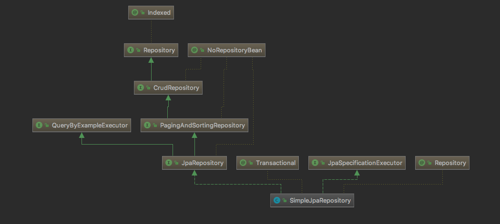

简化现有的持久化开发工作和整合 ORM 技术，Jpa 是一套规范，不是一套产品

Spring Boot Jpa 是 Spring 基于 ORM 框架、Jpa 规范的基础上封装的一套 Jpa 应用框架


1、考虑分页 

2、对普通sql的支持

3、多数据源

4、分表查询

5、多表关联查询



基本实现

```
七个Repository接口：
　　　　1.Repository
　　　　2.CrudRepository
　　　　3.PagingAndSortingRepository
　　　　4.QueryByExampleExecutor
　　　　5.JpaRepository
　　　　6.JpaSpeccificationExecutor
　　　　7.QueryDslPredicateExecutor
两个实现类：
　　　　1.SimpleJpaRepository
　　　　2.QueryDslJpaRepository
```

**1、使用**

```
接口继承自Repository或Repositoy的一个子接口
在接口中声明查询方法
注入Repository实例并使用

注意：
findByUserName这种，根据查找时传入的参数需要与数据库类型保持一致
```

JPA自带的几种主键生成策略：

```
TABLE： 使用一个特定的数据库表格来保存主键
SEQUENCE： 根据底层数据库的序列来生成主键，条件是数据库支持序列。这个值要与generator一起使用，generator 指定生成主键使用的生成器（可能是orcale中自己编写的序列）
IDENTITY： 主键由数据库自动生成（主要是支持自动增长的数据库，如mysql）
AUTO： 主键由程序控制，也是GenerationType的默认值
```

注解：

```
@Table(name = "表名")    用在类上, 映射数据库中的表 
@Entity                             标记这是一个实体类
@Id                                   标记这个属性是主键
@GenerateValue(strategy = GenerateType.AUTO) 注解生成策略
@column(name = "字段名")    映射数据表中字段名称
@OneToOne、@ManyToOne、@OneToMany 表字段间映射关系
```

**2、分页排序：**

在查询的方法中，需要传入参数`Pageable` ,当查询中有多个参数的时候`Pageable`建议做为最后一个参数传入.

```java
Page<User> findALL(Pageable pageable);
Page<User> findByUserName(String userName,Pageable pageable);
```

`Pageable` 是 Spring 封装的分页实现类，使用的时候需要传入页数、每页条数和排序规则

`Pageable`分页

`Sort`排序

**3、自定义 SQL 查询：**

使用`@Query`注解

涉及到删除和修改在需要加上`@Modifying`注解

根据需要添加 `@Transactional`对事物的支持，查询超时的设置等。

```java
@Transactional
@Modifying// 涉及到修改、删除则需要再加上@Modifying注解
@Query("delete from User where id = ?1")
void deleteByUserId(Long id);

## @Query注解还支持通过将nativeQuery标志设置为true来执行原生查询
@Query(value = "select * from tb_user u where u.email = ?1", nativeQuery = true)
User queryByEmail(String email);
```


**4、多表查询：**

```java

```

**5、缓存**

spring boot  jpa 底层实现为hibernate，

```
hibernate的缓存机制分为
1. 一级缓存（session缓存）默认开启
2. 二级缓存（id查询缓存，sessionFactory）
3. 查询缓存 
```


**方法及生产成SQL如下表所示**

|      Keyword      | Sample                                  | JPQL snippet                                                 |
| :---------------: | --------------------------------------- | ------------------------------------------------------------ |
|        And        | findByLastnameAndFirstname              | … where x.lastname = ?1 and x.firstname = ?2                 |
|        Or         | findByLastnameOrFirstname               | … where x.lastname = ?1 or x.firstname = ?2                  |
|     Is,Equals     | findByFirstnameIs,findByFirstnameEquals | … where x.firstname = ?1                                     |
|      Between      | findByStartDateBetween                  | … where x.startDate between ?1 and ?2                        |
|     LessThan      | findByAgeLessThan                       | … where x.age < ?1                                           |
|   LessThanEqual   | findByAgeLessThanEqual                  | … where x.age ⇐ ?1                                           |
|    GreaterThan    | findByAgeGreaterThan                    | … where x.age > ?1                                           |
| GreaterThanEqual  | findByAgeGreaterThanEqual               | … where x.age >= ?1                                          |
|       After       | findByStartDateAfter                    | … where x.startDate > ?1                                     |
|      Before       | findByStartDateBefore                   | … where x.startDate < ?1                                     |
|      IsNull       | findByAgeIsNull                         | … where x.age is null                                        |
| IsNotNull,NotNull | findByAge(Is)NotNull                    | … where x.age not null                                       |
|       Like        | findByFirstnameLike                     | … where x.firstname like ?1                                  |
|      NotLike      | findByFirstnameNotLike                  | … where x.firstname not like ?1                              |
|   StartingWith    | findByFirstnameStartingWith             | … where x.firstname like ?1 (parameter bound with appended %) |
|    EndingWith     | findByFirstnameEndingWith               | … where x.firstname like ?1 (parameter bound with prepended %) |
|    Containing     | findByFirstnameContaining               | … where x.firstname like ?1 (parameter bound wrapped in %)   |
|      OrderBy      | findByAgeOrderByLastnameDesc            | … where x.age = ?1 order by x.lastname desc                  |
|        Not        | findByLastnameNot                       | … where x.lastname <> ?1                                     |
|        In         | findByAgeIn(Collection ages)            | … where x.age in ?1                                          |
|       NotIn       | findByAgeNotIn(Collection age)          | … where x.age not in ?1                                      |
|       TRUE        | findByActiveTrue()                      | … where x.active = true                                      |
|       FALSE       | findByActiveFalse()                     | … where x.active = false                                     |
|    IgnoreCase     | findByFirstnameIgnoreCase               | … where UPPER(x.firstame) = UPPER(?1)                        |

