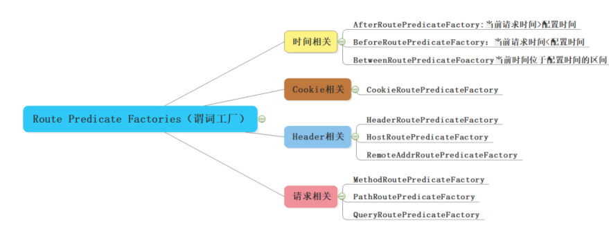
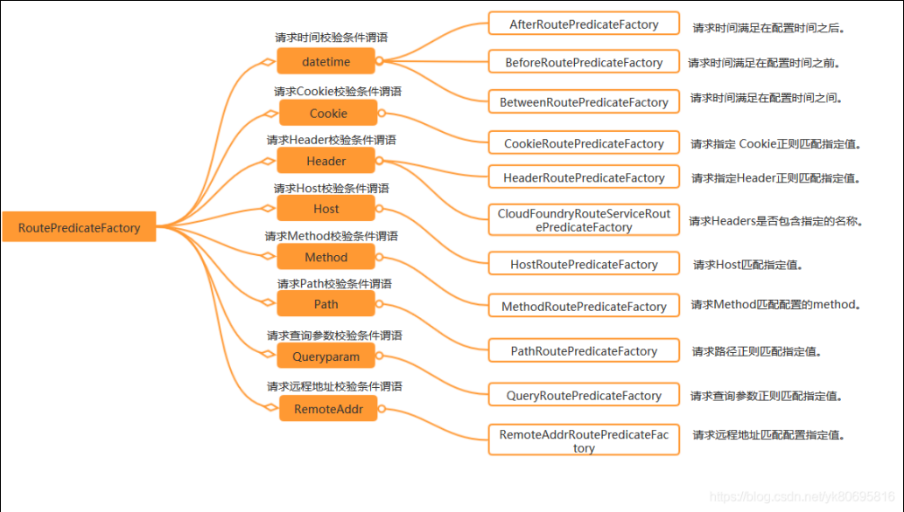

##### Gateway




路由：

```properties
网关服务
通过http://127.0.0.1:8888/api-order/order（网关的ip）， 路由到 service-order服务
## http://127.0.0.1:8888/api-order/order --> http://127.0.0.1:6666/order --> http://127.0.0.1:6666/storage
routes:
  - id: gateway-route
    uri: lb://service-order  # 服务前加上lb://
    predicates: # 断言
      - Path=/api-order/** # 根据路径匹配
      - After=2019-01-20T17:42:47.789-07:00[America/Denver] # 匹配所有UTC时间Jan 20, 2019 17:42后的请求，并且路由到uri:https://service-order
      - Cookie=chocolate, ch.p # 当请求携带的cookie和Cookie断言工厂配置的一致，则路由匹配成功
      - Header=X-Request-Id, \d+ # 匹配请求头中包含 X-Request-Id 且值为一个或者多个数字的请求
      - Method=GET # 配置的Method对请求方式是Get
      - Query=foo,baz # 根据请求中的两个参数进行断言匹配
      - RemoteAddr=192.168.1.1/24 # 当请求IP地址在网段之内或者和配置的IP相同
```





##### Fiilter：

全局过滤器：可用在鉴权，日志拦截等。无需在配置文件中配置，作用在所有路由上。

最终通过GatewayFilterAdapter包装成GatewayFilterChain可识别的过滤器，它为请求业务以及路由的URI转换为真实业务服务的请求地址的核心过滤器

```java
Slf4j
public class TokenFilter implements GlobalFilter, Ordered {
    @Override
    public Mono<Void> filter(ServerWebExchange exchange, GatewayFilterChain chain) {
        // 拦截逻辑
        return chain.filter(exchange);
    }
}
```

局部过滤器：使用GatewayFilter，将应用注册到单个路由或一个分组的路由上


使用注意：

（1）关于找不到DownloadBalancerWebClientBuilderBeanPostProcessor that could not be found

```xml
<!--负载均衡-->
<!-- 用于解决springcloud整合gateway引入nacos报Parameter 0 of method loadBalancerWebClientBuilderBeanPostProcessor that could not be found -->
<!-- 方法二，是降低springboot与springcloud版本，降到2.4以下（不包含2.4）-->
<dependency>
    <groupId>org.springframework.cloud</groupId>
    <artifactId>spring-cloud-starter-loadbalancer</artifactId>
</dependency>
```

（2）关于限流

2.4后面引不进下面的包

```xml
<!-- 熔断、降级 -->
<dependency>
    <groupId>org.springframework.cloud</groupId>
    <artifactId>spring-cloud-starter-netflix-hystrix</artifactId>
</dependency>
```