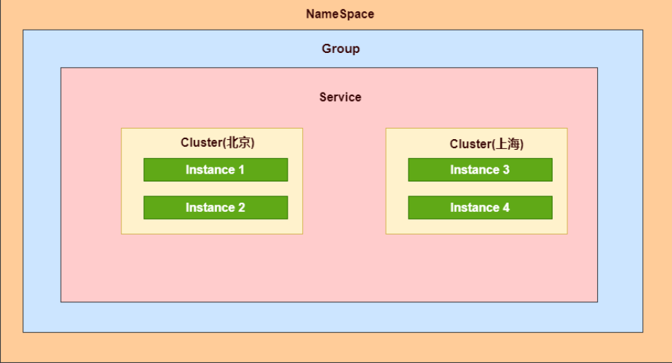

#### 一、数据模型

Nacos 数据模型 Key 由三元组唯一确定，Namespace默认是空串，公共命名空间（public），分组默认

是 DEFAULT_GROUP。

**Namespace** **（命名空间）**：用于进行租户粒度的配置隔离。不同的命名空间下，可以存在相同的

Group 或 Data ID 的配置。Namespace 的常用场景之一是不同环境的配置的区分隔离，例如开发测试

环境和生产环境的资源（如配置、服务）隔离等。

**Group** **（服务分组）**：不同的服务可以归类到同一分组。

**Service** **（服务）**：通过预定义接口网络访问的提供给客户端的软件功能，比如：订单服务、仓储服务

**Cluster** **（虚拟集群）**：同一个服务下的所有服务实例组成一个默认集群, 集群可以被进一步按需求划

分，划分的单位可以是虚拟集群。

**Instance** **（实例）**：提供一个或多个服务的具有可访问网络地址（IP:Port）的进程。

Nacos支持三种部署模式

单机模式 - 用于测试和单机试用。

集群模式 - 用于生产环境，确保高可用。

多集群模式 - 用于多数据中心场景

二、原理

