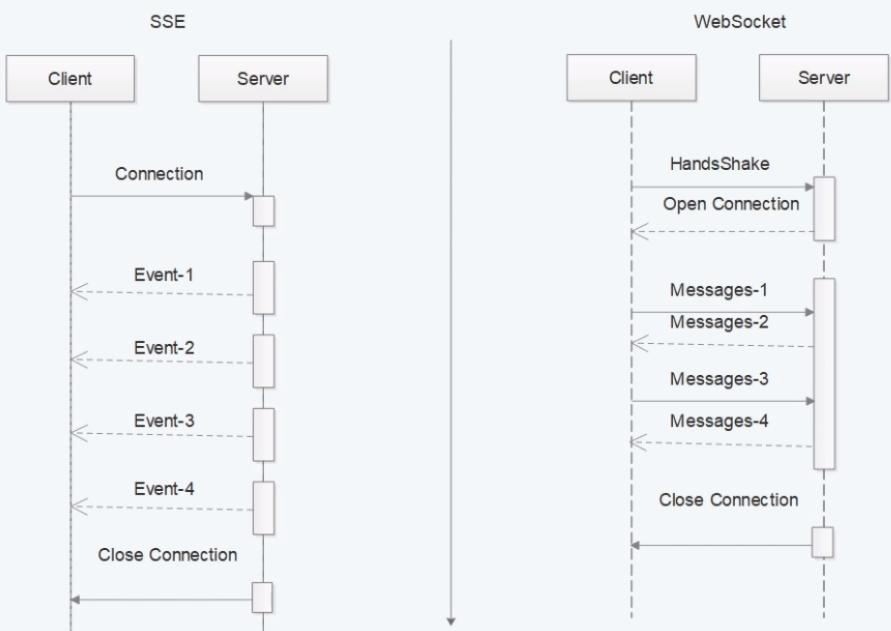

一、Reactive 

 **Reactive Streams（响应式流）**

**一般由以下组成：**

- `publisher`：发布者，发布元素到订阅者
- `subscriber`：订阅者，消费元素
- `subscription`：订阅，在发布者中，订阅被创建时，将与订阅者共享
- `processor`：处理器，发布者与订阅者之间处理数据，包含了发布者与订阅者的共同体

Reactor 中，经常使用的类并不是很多，主要有以下两个：

* Mono 实现了 org.reactivestreams.Publisher 接口，代表0到1个元素的发布者。

* Flux 实现了 org.reactivestreams.Publisher 接口，实现发布者，并返回 N 个元素

**Reactive Streams** **是规范，**Reactor **实现了** Reactive Streams。Web Flux **以**Reactor **为基础，实现** **Web** **领域的反应式编程框架。**

二、SSE和WebSocket的区别

Server-Sent Events(SSE事件)

1、SSE是单向的，建立连接后，只能从服务器端向客户端发送数据

2、WebSocket是双向的，客户端和服务器端建立连接后，双方可以相互发送消息

