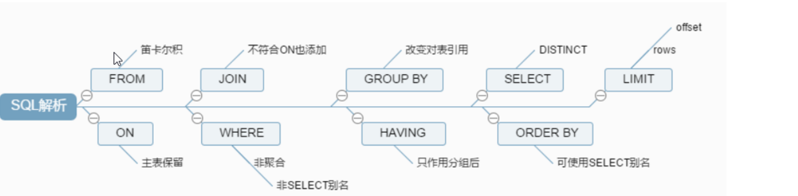

一、SQL慢的原因：

执行时间长

等待时间长


二、SQL执行的顺序

手写

```sql
select DISTINCT
	select_list
FROM
	left_table
JOIN right_table
WHERE
	where_condition
GROUP BY
	group_by_list
HAVING
	having_condition
ORDER BY
	order_by_condition
LIMIT limit number
```

机器




三、

最大的性能瓶颈就是在于磁盘 IO，用不同方法所读取的数据量有很大不同


在整个系统的性能优化中，如果按照百分比来划分上面几个层面的优化带来的性能收益，可以得出大概的数据：

需求和架构及业务实现优化：55%

Query 语句的优化：30%

数据库自身的优化：15%


四、SQL优化：

（1）索引是否得当？是否失效

（2）表结构是否合理，数据类型是否正确

（3）是否使用适当的 [锁定策略](https://dev.mysql.com/doc/refman/8.0/en/locking-issues.html)？


```
Query 语句的优化思路和原则主要提现在以下几个方面：
1. 优化更需要优化的 Query；
2. 定位优化对象的性能瓶颈；
3. 明确的优化目标；
4. 从 Explain 入手；
5. 多使用 profile
6. 永远用小结果集驱动大的结果集；
7. 尽可能在索引中完成排序；
8. 只取出自己需要的 Columns；
9. 仅仅使用最有效的过滤条件；
10. 尽可能避免复杂的 Join 和子查询；
```


主要结合业务，从索引，sql语句方面优化，考虑业务调整，表是否能拆分，mysql的参数


##### （1）explain出来的各种item的意义；

通过explain观察SQL来优化索引，优化sql语句

**rows**： 估算出结果集行数，表示MySQL根据表统计信息及索引选用情况，估算值，不准


##### （2）SQL索引的失效场景

查询出的量多大

查询条件含有函数


##### （3）SHOW PROFILES;

用来分析当前会话中sql语句执行时资源消耗情况

```sql
show profile CPU,SWAPS,BLOCK IO,MEMORY,SOURCE for query 520;
```


##### （4）limit优化

1、记录每次取出后的最大id 然后 where id > 最大id limit 10


##### （5）select * from a join b on a.c = b.c 和 select * from a,b where a.c = b.c 的区别

select * from a,b where a.c=b.c 等价于 inner join

select * from a, b where a.c=b.c(先取后算）

select * from a inner join b on a.c = b.c(取中带算) 

性能方面inner join较好

left join 会显示左表的所有列，右表没有值的null代替，right join 与之相反。


##### （6）between and 与 limit 与  id > ? 的区别

1、SELECT * FROM table WHERE id BETWEEN 1809507935 AND 1809508935

rows 为 BETWEEN AND区间数量，and之间的id没有数据，取出就是0条

2、SELECT * FROM table WHERE id > 1809507935 LIMIT 1000

rows 为 大于id 的所有数据，将大于id的全部扫描，再取出1000条

3、SELECT * FROM table ORDER BY id LIMIT 8,1000 

rows为 limit前后相加，即limit 1000,1000 就是2000 


##### （7）delete in 不走索引

```sql
delete from account where name in (select name from old_account);
/* 加别名*/
explain delete a from account as a where a.name in (select name from old_account)

explain select * from account where name in (select name from old_account);
show WARNINGS;

```

1、`delete in子查询`改为**join**的方式。


2、delete in子查询走索引;**加别名呢**，会走**LooseScan策略**，而LooseScan策略，本质上就是**semi join子查询**的一种执行策略。

**LooseScan是什么呢？** 其实它是一种策略，是**semi join子查询**的一种执行策略。