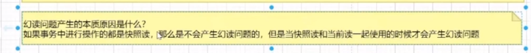

##### 一、事务的隔离级别

READ_UNCOMMITTED ：会出现脏读、不可重复读、幻读 ( 隔离级别最低，并发性能高 )

READ_COMMITTED ：两次读取结果不一致，会出现不可重复读、幻读问题（锁定正在读取的行）

REPEATABLE_READ ：会出幻读（锁定所读取的所有行）

SERIALIZABLE ：保证所有的情况不会发生（锁表）


##### 二、脏读，不可重复读，幻读

脏读：一个事务正在访问数据，并对数据进行修改，该修改还没提交；另外一事务也访问这个数据，然后使用了这个数据。

不可重复读：一个事务内，多次读同一数据，事务还没结束时，另外一事务也访问该同一数据。那么，在第一个事务中的两 次读数据之间，由于第二个事务的修改，那么第一个事务两次读到的的数据可能是不一样的。

幻读：指当事务不是独立执行时发生的一种现象，例如第一个事务对一个表中的数据进行了修改，这种修改涉及到表中的全部数据行。 同时，第二个事务也修改这个表中的数据，这种修改是向表中插入一行新数据。那么，以后就会发生操作第一个事务的用户发现表中还有没有修改的数据行


注意：

不可重复读的重点是**修改** : 同样的条件 ,  你读取过的数据 ,  再次读取出来发现值不一样了 

幻读的重点在于**新增或者删除** 



##### 三、事务基本特性

（1）ACID ：

**原子性**指的是一个事务中的操作要么全部成功，要么全部失败。

**一致性**指的是数据库总是从一个一致性的状态转换到另外一个一致性的状态。比如 A 转账给 B100 块钱，假设中间 sql 执行过程中系统崩溃 A 也不会损失 100 块，因为事务没有提交，修改也就不会保存到数据库。

**隔离性**指的是一个事务的修改在最终提交前，对其他事务是不可见的。

**持久性**指的是一旦事务提交，所做的修改就会永久保存到数据库中。

（2）如何保证：

A 原子性由 undo log 日志保证，它记录了需要回滚的日志信息，事务回滚时撤销已经执行成功的 sql

C 一致性一般由另外三个层面保证

I 隔离性由 MVCC 来保证

D 持久性由内存+redo log 来保证，mysql 修改数据同时在内存和 redo log 记录这次操作，事务提交的时候通过 redo log 刷盘，宕机的时候可以从 redo log 恢复


##### 四、隔离级别的实现

​		通过对读写操作加不同的锁，以及对释放锁的时机进行不同的控制，就可以实现四种隔离级别。

​		传统的隔离级别是基于锁实现的，这种方式叫做 **基于锁的并发控制（Lock-Based Concurrent Control，简写 LBCC）**。

​		通过对读写操作加不同的锁，以及对释放锁的时机进行不同的控制，就可以实现四种隔离级别。

​		传统的锁有两种：读操作通常加共享锁（Share locks，S锁，又叫读锁），写操作加排它锁（Exclusive locks，X锁，又叫写锁）；加了共享锁的记录，其他事务也可以读，但不能写；加了排它锁的记录，其他事务既不能读，也不能写。


**RC 只加记录锁，RR 除了加记录锁，还会加间隙锁，用于解决幻读问题**


归纳起来，四种隔离级别的加锁策略如下：

- 读未提交（Read Uncommitted）：事务读不阻塞其他事务读和写，事务写阻塞其他事务写但不阻塞读；通过对写操作加 “持续X锁”，对读操作不加锁 实现；
- 读已提交（Read Committed）：事务读不会阻塞其他事务读和写，事务写会阻塞其他事务读和写；通过对写操作加 “持续X锁”，对读操作加 “临时S锁” 实现；不会出现脏读；
- 可重复读（Repeatable Read）：事务读会阻塞其他事务事务写但不阻塞读，事务写会阻塞其他事务读和写；通过对写操作加 “持续X锁”，对读操作加 “持续S锁” 实现；
- 序列化（Serializable）：为了解决幻读问题，行级锁做不到，需使用表级锁。


##### 五、查看和设置 MySQL 的隔离级别

```sql
mysql> select @@tx_isolation;
+-----------------+
| @@tx_isolation |
+-----------------+
| REPEATABLE-READ |
+-----------------+
```