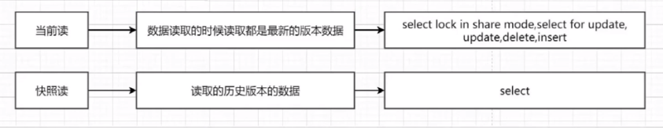

**快照读**

​		就是简单的`select`查询，查询的都是快照版本，这个场景下因为都是基于MVCC来查询快照的某个版本，所以不会存在幻读的问题，也可以认为是解决了幻读的方案之一

​		快照读是MVCC要解决的的场景

​		RC下**读取该记录最新的一次快照**，RR 是读取该**记录事务开始时的那个版本**

**当前读**

​		指的是`lock in share mode`、`for update` 、`insert`、`update`、`delete`这些需要加锁的操作。

就是它读取的是记录的最新版本，读取时还要保证其他并发事务不能修改当前记录，会对读取的记录进行加锁

​		当前读是Next-Key Lock要解决的事情。

​		读取数据的最新版本，并会对数据加锁，锁分为：

- SELECT ... LOCK IN SHARE MODE：加 S 锁
- SELECT ... FOR UPDATE：加 X 锁
- INSERT / UPDATE / DELETE：加 X 锁




一、for update

（1）概念

​		一种行级锁，又叫排它锁，一旦用户对某个行施加了行级加锁，则该用户可以查询也可以更新被加锁的数据行，其它用户只能查询但不能更新被加锁的数据行

（2）用法

在mysql中，如果查询条件带有主键，会锁行数据，如果没有，会锁表。

InnoDB预设是Row-Level Lock，所以只有「明确」的指定主键，MySQL才会执行Row lock (只锁住被选取的资料例) ，否则MySQL将会执行Table Lock (将整个资料表单给锁住)。

```sql
例1: (明确指定主键，并且数据真实存在，row lock)
SELECT * FROM user WHERE id=3 FOR UPDATE;
SELECT * FROM user WHERE id=3 and name='Tom' FOR UPDATE;

例2: (明确指定主键，但数据不存在，无lock)
SELECT * FROM user WHERE id=0 FOR UPDATE;

例3: (主键不明确，table lock)
SELECT * FROM user WHERE id<>3 FOR UPDATE;
SELECT * FROM user WHERE id LIKE '%3%' FOR UPDATE;

例4: (无主键，table lock)
SELECT * FROM user WHERE name='Tom' FOR UPDATE;
```

（3）锁的释放

当出现如下之一的条件，才会释放共享更新锁：

1、执行提交（COMMIT）语句
2、退出数据库（LOG　OFF）
3、程序停止运行


（4）什么时候需要使用

需要业务层面数据独占时，可以考虑使用for update。


注意：

1、FOR UPDATE仅适用于InnoDB，且必须在事务处理模块(BEGIN/COMMIT)中才能生效。

2、要测试锁定的状况，可以利用MySQL的Command Mode(命令模式) ，开两个视窗来做测试。

3、Myisam 只支持表级锁，InnerDB支持行级锁 添加了(行级锁/表级锁)锁的数据不能被其它事务再锁定，也不被其它事务修改。是表级锁时，不管是否查询到记录，都会锁定表。


二、lock in share mode

（1）概念

共享锁

（2）使用

**共享锁，事务都加，都能读。修改是惟一的，必须等待前一个事务 commit，才可**

- 允许其它事务也增加共享锁读取
- 不允许其它事物增加排他锁 (`for update`)
- 当事务同时增加共享锁时候，事务的更新必须等待先执行的事务 commit 后才行，如果同时并发太大可能很容易造成死锁


（3）总结

- 事务之间不允许其它排他锁或共享锁读取，修改更不可能
- 一次只能有一个排他锁执行 commit 之后，其它事务才可执行