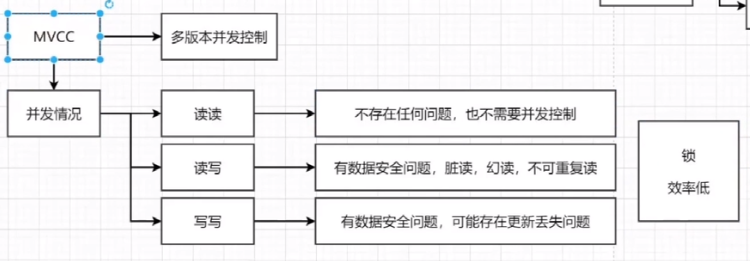

#### MVCC 简介

叫做多版本并发控制，实际上就是保存了数据在某个时间节点的快照。

每开始一个新的事务，版本号都会自动递增。

MVCC 的原理是查找创建版本小于或等于当前事务版本，删除版本为空或者大于当前事务版本


 RR 和 RC 隔离级别都实现了 MVCC 来满足读写并行，但是读的实现方式是不一样的：

**RC 总是读取记录的最新版本，如果该记录被锁住，则读取该记录最新的一次快照，而 RR 是读取该记录事务开始时的那个版本。**


#### 解决问题

- 读写之间阻塞的问题，在并发读写数据库时，可以做到在读操作时不用阻塞写操作，写操作也不用阻塞读操作，提高了数据库并发读写的性能
- 解决脏读，幻读，不可重复读等事务隔离问题，但不能解决更新丢失问题




#### MVCC的实现原理

目的就是多版本并发控制，在数据库中的实现，就是为了解决`读写冲突`，

它的实现原理主要是依赖记录中的 `3个隐式字段`，`undo日志` ，`Read View` 来实现的。

（1）隐式字段

```sql
DB_TRX_ID`,`DB_ROLL_PTR`,`DB_ROW_ID

DB_TRX_ID	6byte，最近修改(修改/插入)事务ID：记录创建这条记录/最后一次修改该记录的事务ID
DB_ROLL_PTR	7byte，回滚指针，指向这条记录的上一个版本（存储于rollback segment里）
DB_ROW_ID	6byte，隐含的自增ID（隐藏主键），如果数据表没有主键，InnoDB会自动以DB_ROW_ID产生一个聚簇索引
实际还有一个删除flag隐藏字段, 既记录被更新或删除并不代表真的删除，而是删除flag变了
```


#### 快照读和MVCC的关系

MVCC是一个概念， “维持一个数据的多个版本，使得读写操作没有冲突” 

快照读是实现MVCC理想模型的其中一个具体非阻塞读功能


#### MVCC不能解决幻读


快照读与当前读混用，导致事务A第三次查询能查到事务C提交的数据