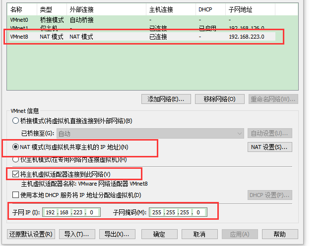

1、安装mini linux

```
1、修改时间
2、选择磁盘
3、root密码
正常安装
```

2、配置网卡，绑定静态IP

vim /etc/sysconfig/network-scripts/ifcfg-ens33

service network restart

```shell
BOOTPROTO=static
ONBOOT=yes
IPADDR=192.168.223.6
NETMASK=255.255.255.0
GATEWAY=192.168.223.2
DNS1=8.8.8.8
```

3、配置网关


4、虚拟网络配置



5、测试

ping baidu.com