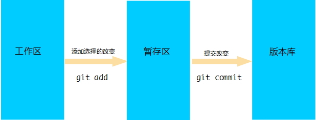
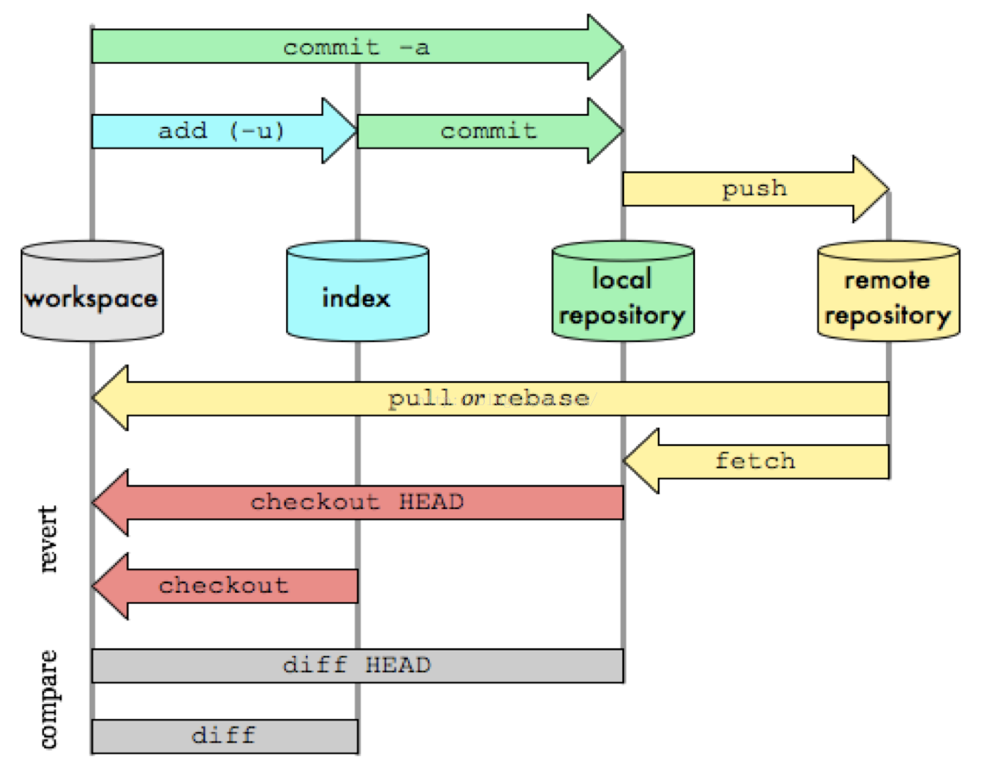

Git是用C语言开发的


##### 版本控制系统分类

- 分布式版本控制系统：GIT
- 集中式版本控制系统：CVS、SVN

GIT优点：

```
适合分布式开发，强调个体。
公共服务器压力和数据量都不会太大。
速度快、灵活。
任意两个开发者之间可以很容易的解决冲突。
离线工作。
```

安装

注意`git config`命令的`--global`参数，用了这个参数，表示你这台机器上所有的Git仓库都会使用这个配置

```shell
$ git config --global user.name "Your Name"
$ git config --global user.email "email@example.com"
```

创建仓库

```shell
## 创建一个空目录
$ mkdir learngit
$ cd learngit
$ pwd
/Users/michael/learngit
## 通过git init命令把这个目录变成Git可以管理的仓库
$ git init
Initialized empty Git repository in /Users/michael/learngit/.git/
```

提交文件到仓库

```shell
## 命令git add <file>，可反复多次使用，添加多个文件，把文件添加到仓库
$ git add file1.txt
$ git add file2.txt file3.txt
## 命令git commit -m <message>，完成文件提交到仓库
$ git commit -m "add 3 files."
```

流程图：




Git相关的配置文件有三个：
1）、 /etc/gitconfig：包含了适用于系统所有用户和所有项目的值。(Win：C:\Program Files\Git\mingw64\etc\gitconfig) --system 系统级

2）、~/.gitconfig：只适用于当前登录用户的配置。(Win：C:\Users\Administrator\.gitconfig)  --global 全局

3）、位于git项目目录中的.git/config：适用于特定git项目的配置。(Win：C:\gitProject) --local当前项目

```shell
## Git配置 - git config

# 可以查看现在的git环境详细配置
git config -l

#查看系统config
git config --system --list
　　
#查看当前用户（global）配置
git config --global  --list
 
#查看当前仓库配置信息
git config --local  --list

# 设置用户名与邮箱（用户标识，必要）
$ git config --global user.name "zhangguo"  #名称
$ git config --global user.email zhangguo@qq.com   #邮箱

# 添加配置项 
git config [--local|--global|--system]  section.key value
[--local|--global|--system]  #可选的，对应本地，全局，系统不同级别的设置，请看2.3.2
section.key #区域下的键
value #对应的值

# 删除配置项 
git config [--local|--global|--system] --unset section.key
```


git的工作流程一般是这样的：

１、在工作目录中添加、修改文件；

２、将需要进行版本管理的文件放入暂存区域；

３、将暂存区域的文件提交到git仓库。

因此，git管理的文件有三种状态：已修改（modified）,已暂存（staged）,已提交(committed)




```shell
## 常用术语

1)、仓库（Repository）:受版本控制的所有文件修订历史的共享数据库

2)、工作空间（Workspace) :本地硬盘或Unix 用户帐户上编辑的文件副本

3)、工作树/区（Working tree）:工作区中包含了仓库的工作文件。您可以修改的内容和提交更改作为新的提交到仓库。

4)、暂存区（Staging area）:暂存区是工作区用来提交更改（commit）前可以暂存工作区的变化。

5)、索引（Index）:索引是暂存区的另一种术语。

6)、签入（Checkin）:将新版本复制回仓库

7)、签出（Checkout）:从仓库中将文件的最新修订版本复制到工作空间

8)、提交（Commit）:对各自文件的工作副本做了更改，并将这些更改提交到仓库

9)、冲突（Conflict）:多人对同一文件的工作副本进行更改，并将这些更改提交到仓库

10)、合并（Merge）:将某分支上的更改联接到此主干或同为主干的另一个分支

11)、分支（Branch）:从主线上分离开的副本，默认分支叫master

12)、锁（Lock）:获得修改文件的专有权限。

13)、头（HEAD）:头是一个象征性的参考，最常用以指向当前选择的分支。

14)、修订（Revision）:表示代码的一个版本状态。Git通过用SHA1 hash算法表示的ID来标识不同的版本。

15)、标记（Tags）:标记指的是某个分支某个特定时间点的状态。通过标记，可以很方便的切换到标记时的状态。
```


文件的四种状态：

```
Untracked: 未跟踪, 此文件在文件夹中, 但并没有加入到git库, 不参与版本控制. 通过git add 状态变为Staged.

Unmodify: 文件已经入库, 未修改, 即版本库中的文件快照内容与文件夹中完全一致. 这种类型的文件有两种去处, 如果它被修改, 而变为Modified. 如果使用git rm移出版本库, 则成为Untracked文件

Modified: 文件已修改, 仅仅是修改, 并没有进行其他的操作. 这个文件也有两个去处, 通过git add可进入暂存staged状态, 使用git checkout 则丢弃修改过, 返回到unmodify状态, 这个git checkout即从库中取出文件, 覆盖当前修改

Staged: 暂存状态. 执行git commit则将修改同步到库中, 这时库中的文件和本地文件又变为一致, 文件为Unmodify状态. 执行git reset HEAD filename取消暂存, 文件状态为Modified
```


```shell
# 在当前目录新建一个Git代码库
$ git init
# 新建一个目录，将其初始化为Git代码库
$ git init [project-name]
# 克隆一个项目和它的整个代码历史(版本信息)
$ git clone [url]

#查看指定文件状态
git status [filename]
#查看所有文件状态
git status

# 添加指定文件到暂存区
$ git add [file1] [file2] ...
# 添加指定目录到暂存区，包括子目录
$ git add [dir]
# 添加当前目录的所有文件到暂存区
$ git add .
# 直接从暂存区删除文件，工作区则不做出改变
git rm --cached <file>
# 如果已经用add 命令把文件加入stage了，就先需要从stage中撤销
git reset HEAD <file>...
# 移除所有未跟踪文件
# 一般会加上参数-df，-d表示包含目录，-f表示强制清除。
git clean [options] 

# 只从stage中删除，保留物理文件
git rm --cached readme.txt 
# 不但从stage中删除，同时删除物理文件
git rm readme.txt 
# 把a.txt改名为b.txt
git mv a.txt b.txt 

# 查看文件修改后的差异
git diff [files]
# 比较暂存区的文件与之前已经提交过的文件
git diff --cached
# 比较repo与工作空间中的文件差异
git diff HEAD~n

$ git checkout branch
#检出branch分支。要完成图中的三个步骤，更新HEAD以指向branch分支，以及用branch  指向的树更新暂存区和工作区。
$ git checkout
#汇总显示工作区、暂存区与HEAD的差异。
$ git checkout HEAD
#同上
$ git checkout -- filename
#用暂存区中filename文件来覆盖工作区中的filename文件。相当于取消自上次执行git add filename以来（如果执行过）的本地修改。
$ git checkout branch -- filename
#维持HEAD的指向不变。用branch所指向的提交中filename替换暂存区和工作区中相   应的文件。注意会将暂存区和工作区中的filename文件直接覆盖。
$ git checkout -- . 或写作 git checkout .
#注意git checkout 命令后的参数为一个点（“.”）。这条命令最危险！会取消所有本地的  #修改（相对于暂存区）。相当于用暂存区的所有文件直接覆盖本地文件，不给用户任何确认的机会！
$ git checkout commit_id -- file_name
#如果不加commit_id，那么git checkout -- file_name 表示恢复文件到本地版本库中最新的状态。

# 提交暂存区到仓库区
$ git commit -m [message]
# 提交暂存区的指定文件到仓库区
$ git commit [file1] [file2] ... -m [message]
# 提交工作区自上次commit之后的变化，直接到仓库区，跳过了add,对新文件无效
$ git commit -a
# 提交时显示所有diff信息
$ git commit -v
# 使用一次新的commit，替代上一次提交
# 如果代码没有任何新变化，则用来改写上一次commit的提交信息
$ git commit --amend -m [message]
# 重做上一次commit，并包括指定文件的新变化
$ git commit --amend [file1] [file2] ...

#撤销上一次的提交
git reset --hard HEAD~1

#查看提交日志
git log [<options>] [<revision range>] [[\--] <path>…​]
```


GIT分支中的常用命令

```shell
# 列出所有本地分支
$ git branch
# 列出所有远程分支
$ git branch -r
# 列出所有本地分支和远程分支
$ git branch -a
# 新建一个分支，但依然停留在当前分支
$ git branch [branch-name]

# 新建一个分支，并切换到该分支
$ git checkout -b [branch]
# 新建一个分支，指向指定commit
$ git branch [branch] [commit]
# 新建一个分支，与指定的远程分支建立追踪关系
$ git branch --track [branch] [remote-branch]
# 切换到指定分支，并更新工作区
$ git checkout [branch-name]
# 切换到上一个分支
$ git checkout -
# 建立追踪关系，在现有分支与指定的远程分支之间
$ git branch --set-upstream [branch] [remote-branch]
# 合并指定分支到当前分支
$ git merge [branch]
# 选择一个commit，合并进当前分支
$ git cherry-pick [commit]
# 删除分支
$ git branch -d [branch-name]
# 删除远程分支
$ git push origin --delete [branch-name]
$ git branch -dr [remote/branch]
```


GIT相关命令

```shell
帮助文档 信息查看与统计命令

#统计某人的代码提交量，包括增加，删除：
git log --author="$(git config --get user.name)" --pretty=tformat: --numstat | gawk '{ add += $1 ; subs += $2 ; loc += $1 - $2 } END { printf 
"added lines: %s removed lines : %s total lines: %s\n",add,subs,loc }' -

#仓库提交者排名前 5（如果看全部，去掉 head 管道即可）：
git log --pretty='%aN' | sort | uniq -c | sort -k1 -n -r | head -n 5

#仓库提交者（邮箱）排名前 5：这个统计可能不会太准，因为很多人有不同的邮箱，但会使用相同的名字
git log --pretty=format:%ae | gawk -- '{ ++c[$0]; } END { for(cc in c) printf "%5d %s\n",c[cc],cc; }' | sort -u -n -r | head -n 5 

#贡献者统计：
git log --pretty='%aN' | sort -u | wc -l

#提交数统计：
git log --oneline | wc -l 

# 显示有变更的文件
$ git status

# 显示当前分支的版本历史
$ git log

# 显示commit历史，以及每次commit发生变更的文件
$ git log --stat

# 搜索提交历史，根据关键词
$ git log -S [keyword]

# 显示某个commit之后的所有变动，每个commit占据一行
$ git log [tag] HEAD --pretty=format:%s

# 显示某个commit之后的所有变动，其"提交说明"必须符合搜索条件
$ git log [tag] HEAD --grep feature

# 显示某个文件的版本历史，包括文件改名
$ git log --follow [file]
$ git whatchanged [file]

# 显示指定文件相关的每一次diff
$ git log -p [file]

# 显示过去5次提交
$ git log -5 --pretty --oneline

# 显示所有提交过的用户，按提交次数排序
$ git shortlog -sn

# 显示指定文件是什么人在什么时间修改过
$ git blame [file]

# 显示暂存区和工作区的差异
$ git diff

# 显示暂存区和上一个commit的差异
$ git diff --cached [file]

# 显示工作区与当前分支最新commit之间的差异
$ git diff HEAD

# 显示两次提交之间的差异
$ git diff [first-branch]...[second-branch]

# 显示今天你写了多少行代码
$ git diff --shortstat "@{0 day ago}"

# 显示某次提交的元数据和内容变化
$ git show [commit]

# 显示某次提交发生变化的文件
$ git show --name-only [commit]

# 显示某次提交时，某个文件的内容
$ git show [commit]:[filename]

# 显示当前分支的最近几次提交
$ git reflog

远程仓库操作

# 下载远程仓库的所有变动
$ git fetch [remote]

# 显示所有远程仓库
$ git remote -v

# 显示某个远程仓库的信息
$ git remote show [remote]

# 增加一个新的远程仓库，并命名
$ git remote add [shortname] [url]

# 取回远程仓库的变化，并与本地分支合并
$ git pull [remote] [branch]

# 上传本地指定分支到远程仓库
$ git push [remote] [branch]

# 强行推送当前分支到远程仓库，即使有冲突
$ git push [remote] --force

# 推送所有分支到远程仓库
$ git push [remote] --all

#简单查看远程---所有仓库
git remote  （只能查看远程仓库的名字）
#查看单个仓库
git  remote show [remote-branch-name]

#新建远程仓库
git remote add [branchname]  [url]

#修改远程仓库
git remote rename [oldname] [newname]

#删除远程仓库
git remote rm [remote-name]

#获取远程仓库数据
git fetch [remote-name] (获取仓库所有更新，但不自动合并当前分支)
git pull (获取仓库所有更新，并自动合并到当前分支)

#上传数据，如git push origin master
git push [remote-name] [branch]
```

