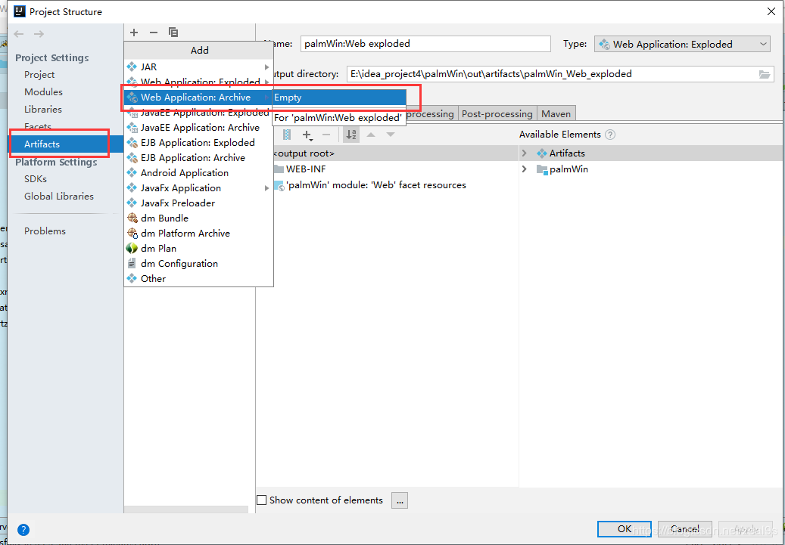
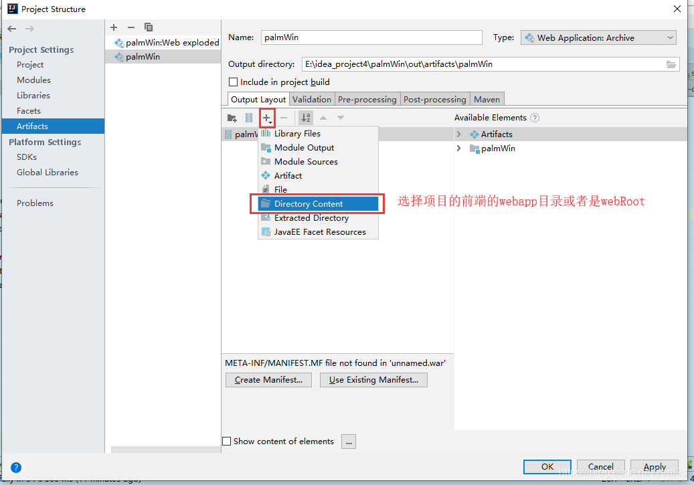
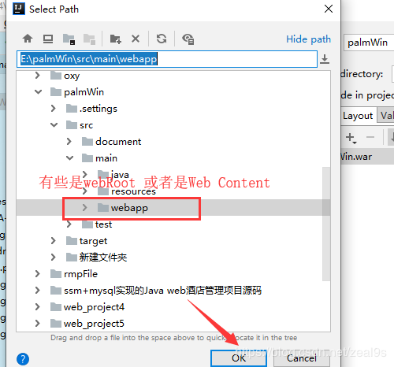
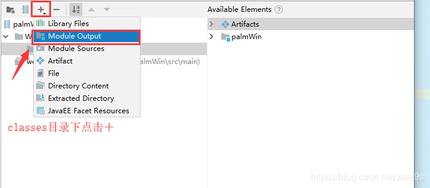
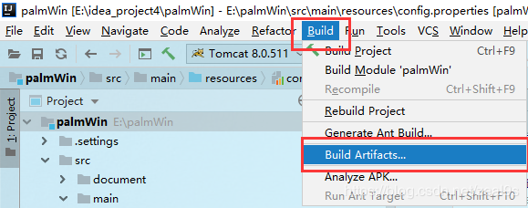
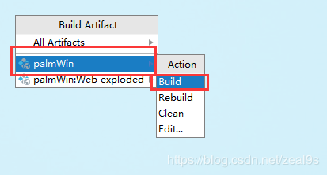

##### 1、打包Web项目成War

（1）【ProjectStructure】中选择左侧的【Artifacts】页签，点击中间上面的，选择【WebApplication:Archive】-> 【Empty】

（2）点击【+】号，选择【Directory Content】

（3）将项目的classes的文件配置好，webapp下或者webRoot，webContent，并创建【WEB-INF】和子目录【classes】目录

（4）点击图标，选择【Module Output】菜单给【classes】目录添加内容

（5）编译及执行打war包

