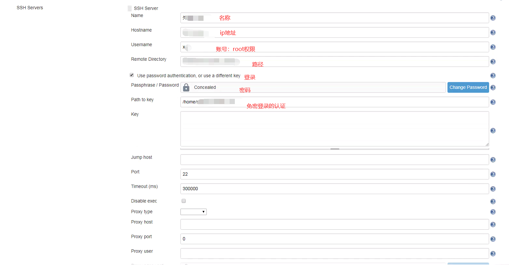
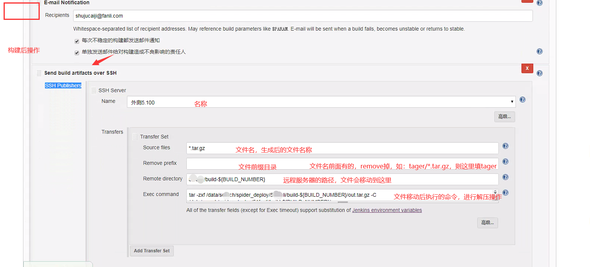

Jenkins插件

build

【File Operations】File Operations

【】Execute shell

Post-build Actions

【Email Extension】E-mail Notification 扩展了发送告警邮件的控制力度。可以定义邮件触发器、邮件内容、收件人。

【Publish Over SSH】Send build artifacts over SHH 通过SSH拷贝文件到目标机器，同时可以在目标机器上执行脚本

【DingTalk】钉钉通知配置器

【Backup】备份Jenkins，自定义备份Jenkins Home目录

【Monitoring】监控Jenkins节点的CPU、系统负载、平均响应时间和内存使用


```
## 关闭Jenkins
/exit 
## 重启Jenkies
/restart 
## 重新加载配置信息
/reload 
```


配置用户

/home/search/.jenkins目录下的config.xml

```
去除标签内的内容
<useSecurity></useSecurity>
  <authorizationStrategy class="hudson.security.FullControlOnceLoggedInAuthorizationStrategy">
  </authorizationStrategy>
  <securityRealm class="hudson.security.SecurityRealm$None"/>
```


**系统管理—>Configure Global Security**


 /home/search/.jenkins

Jenkins储存所有的数据文件在这个目录下. 你可以通过以下几种方式更改：

1. 使用你Web容器的管理工具设置`JENKINS_HOME`环境参数.
2. 在启动Web容器之前设置`JENKINS_HOME`环境变量.
3. (不推荐)更改`Jenkins.war`(或者在展开的Web容器)内的web.xml配置文件.

这个值在Jenkins运行时是不能更改的. 其通常用来确保你的配置是否生效.


jenkins SSH Servers免密

**Publish over SSH**配置



send ssh




```
## Exec command
source /etc/profile
project=你的应用名
dir=你应用存放的目录
pid=`ps -ef | grep $dir$project | grep -v grep | awk '{print $2}'`
if [ -n "$pid" ]
then
   kill -9 $pid
fi
nohup java -Xms64m -Xmx512m -XX:PermSize=32m -XX:MaxPermSize=512m -jar $dir$project --spring.profiles.active=dev >/dev/null 2>&1&
```


邮箱配置

