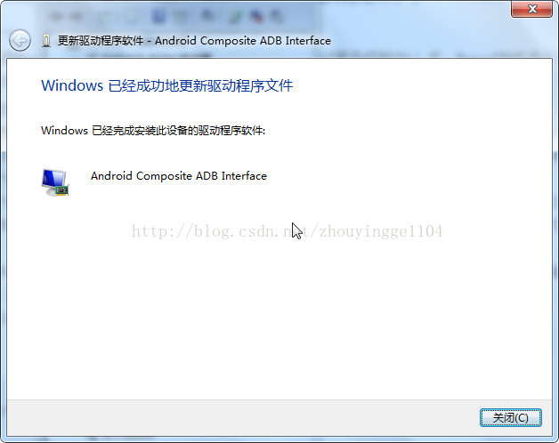

##### win7 连接Android设备失败的问题

步骤：

1. 在设备管理器中，找到ADB Interface，右击，选择“更新驱动程序软件”

2. 在弹出的窗口中选择第二项，也就是“浏览计算机以查找驱动程序软件”

3. 在弹出的窗口中继续选择第二项，也就是“从计算机的设备驱动程序列表中选择”,弹出界面如下:

4. 在弹出的窗口中保持默认选择,即显示所有设备，点击“下一步”

5. 在弹出的窗口中选择“从磁盘安装”

在“从磁盘安装”对话框的“制造商文件复制来源”中，选择电脑上的Android SDK目录中的android_winusb.inf 文件，位置在 %SDK目录%\extras\google\usb_driver 目录中。

6. 选择`android_winusb.inf`路径并确定之后,保持默认,点击“下一步”

7. 安装的过程中可能会出现一些警告信息，忽略，选择继续安装,一路next下去,最终效果如下:

