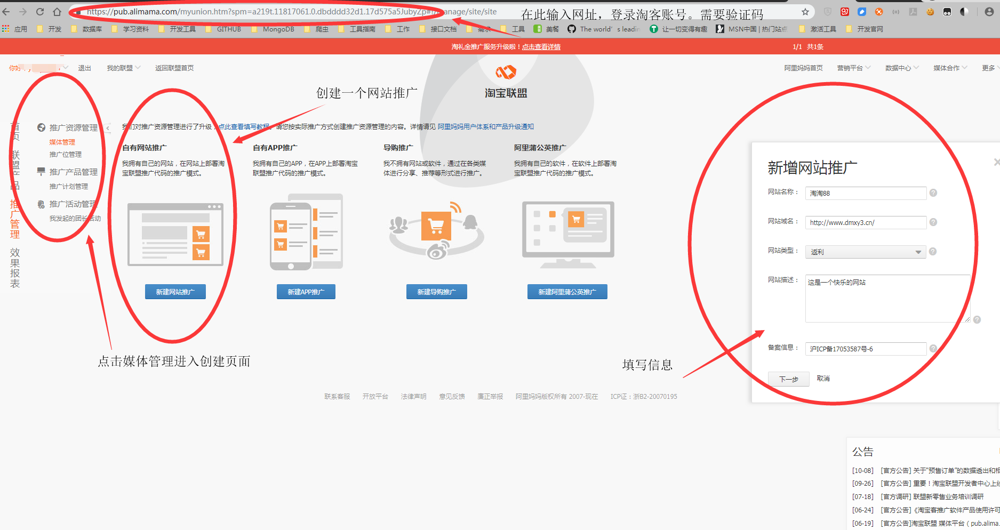
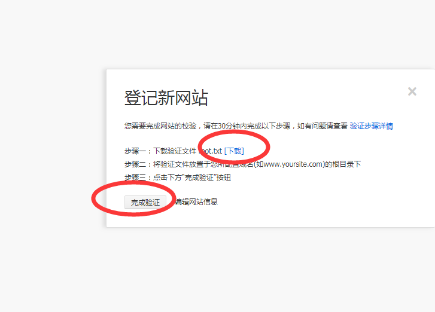
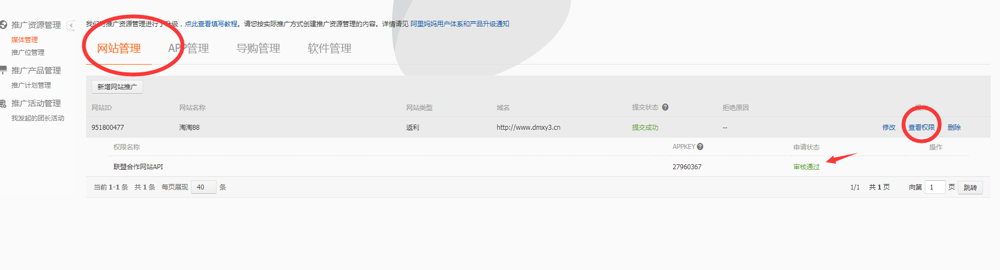
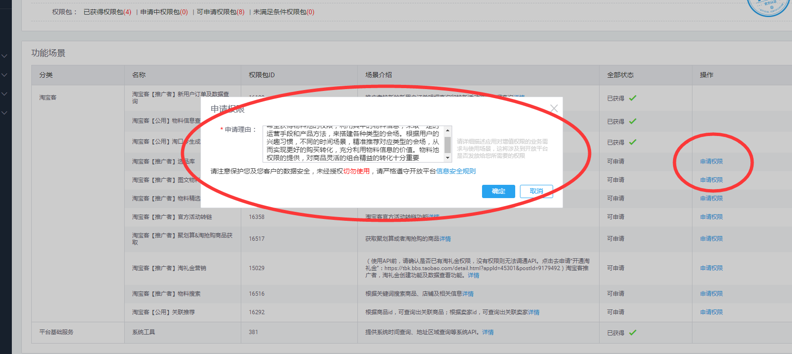
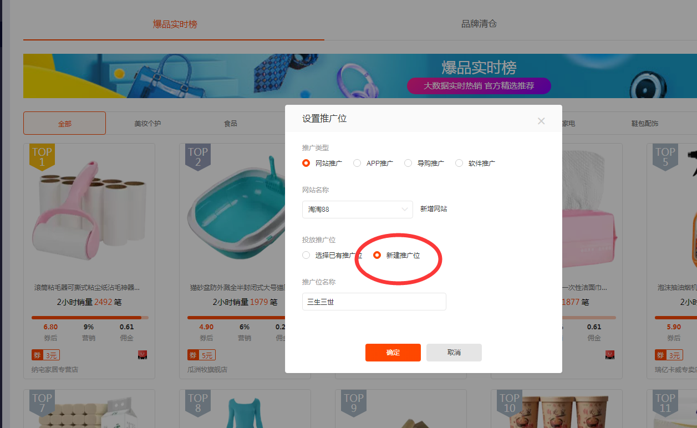

#### 1、淘宝账号新建推广位

（1）创建网站推广

```shell
1、进入网站管理页面：输入https://pub.alimama.com/myunion.htm?#!/manage/site/site
2、点击创建网站推广
3、填写信息
网站，网站备案信息等
4、点击下一步
```



```shell
5、点击下载root.txt文件
6、将该文件交给it，让他们放入相应的目录下（填写的网站）【注意：文件有效期30分钟】
7、完成上述步骤后再点完成验证
```



```
8、等待审核通过后，点击查看权限，申请权限，再等审核通过
9、然后点击查看权限，申请权限
10、申请权限填写相应的理由后再申请
例子：希望获得物料池的权限，利用其中的物料信息，采取一定的运营手段和产品方法，来搭建各种类型的会场。根据用户的兴趣习惯，不同的时间场景，精准推荐对应类型的会场，从而实现更好的购买转化，充分利用物料信息的价值。物料池权限的提供，对商品灵活的组合精益的转化十分重要
```





```shell
11、进入选品库里，申请推广位
12、如图选择推广商品后，新建一个推广位
```



```
13、查看推广位
14、验证appkey权限，通过调用物料池接口观察是否可调
```

